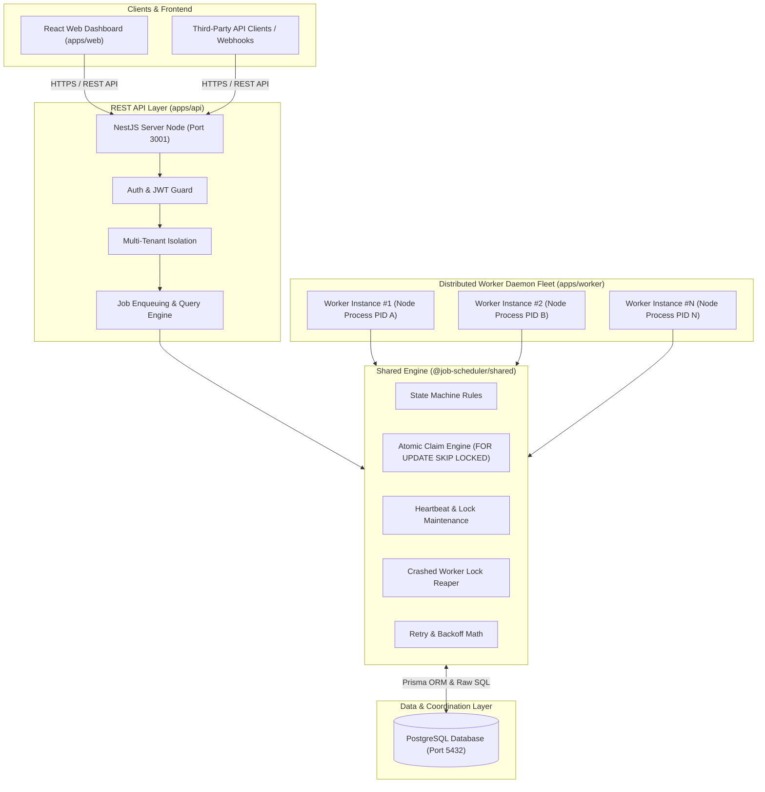
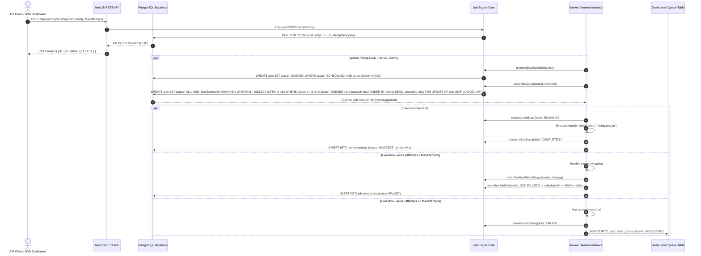

# System Architecture & Flow Documentation

This document outlines the distributed architecture, component interactions, database coordination model, job lifecycle state machine, and horizontal scaling strategies of the **Distributed Job Scheduling Platform**.

---

## 1. System Components & Communications Topology

---

## 2. End-to-End Job Lifecycle

---

## 3. Horizontal Scaling & High-Concurrency Guarantees

1. **Database as Single Source of Truth**:
   - PostgreSQL acts as the atomic coordinator. Row-level locks obtained via `SELECT ... FOR UPDATE SKIP LOCKED` guarantee that multiple independent worker OS processes never double-claim or execute the same job concurrently.
2. **Stateless API & Worker Nodes**:
   - Multiple `apps/api` NestJS instances can sit behind a load balancer.
   - Workers self-register with unique instance UUIDs (`hostname-pid-suffix`) in the `workers` database table and maintain liveness via heartbeat sweeps (`upsertWorkerHeartbeat`).
3. **Crashed Worker Recovery**:
   - If a worker node crashes or loses network connectivity mid-execution, its active lock (`lockExpiresAt`) expires after 30 seconds.
   - The background Reaper process (`reapStaleJobs()`) automatically identifies expired locks, releases the lock, increments `attemptCount`, and returns the job to `QUEUED` status for other healthy workers to claim.
